

 

[?branchName=master)](https://dev.azure.com/aldocorbellini0395/FSDA/_build/latest?definitionId=2&branchName=master)

## 🤝 Support

Contributions, issues, feature requests and sponsorship are all welcome!

Give a ⭐️ if you like this project!

# [Flexible Robust Statistics Data Analysis](https://github.com/UniprJRC/FSDA/)

## FSDA release  2025a is out. (April 2025)

| New Features and Changes |
| --- |
| [release_notes (HTML file)](http://rosa.unipr.it/FSDA/release_notes.html)
| <a href="https://youtu.be/yx569ZBGd58">   Release notes (YouTube video) </a>|
 

In order to run the new features run the file below and enjoy!!!

| FileName | View :eyes:| Run ▶️ | Jupiter notebook |
| -------- | ---- | --- | ---- |
|`New_features_FSDA2025a`: examples with the new features  |  |   | [New_features_FSDA2025a.ipynb](https://github.com/UniprJRC/FSDA/blob/master/toolbox/doc/New_features_FSDA2025a.ipynb) |

## FSDA release  2024b is out (November 2024)

New Features and Changes

**MODEL SELECTION**

New routine [univariatems](http://rosa.unipr.it/FSDA/univariatems.html) which enables to exclude  variables which are are surely not significant. The step is  preliminary to (robust) variable selection.

**ROBUST CENSORED REGRESSION**

New set of of routines for censored regression (including transformations). All these routines contain inside file name the word "Cens". The tobit model is a particular case of censored regression. More specifically. 
 
New function regressCens for censored regression

New function [FSRedaCens](http://rosa.unipr.it/FSDA/FSRedaCens.html) to monitor the residuals in censored regression

New function [regressCensTra](http://rosa.unipr.it/FSDA/regressCensTra.html) which computes the mle of transformation parameter and signed sqrt likelihood ratio test in the censored regression model

New function [FSRfanCens](http://rosa.unipr.it/FSDA/FSRfanCens.html) which monitors the signed sqrt root likelihood ratio test 

**DATASETS**

New regression datasets, affairs and Esselunga

**TRANSFORMATION**

New option bsb in functions normYJ and normBoxCox

**DISTRIBUTIONS**

New functions [tobitcdf](http://rosa.unipr.it/FSDA/tobitcdf.html), [tobitpdf](http://rosa.unipr.it/FSDA/tobitpdf.html), [tobitrnd](http://rosa.unipr.it/FSDA/tobitrnd.html) and [tobitinv](http://rosa.unipr.it/FSDA/tobitinv.html) which compute the cdf, pdf, random numnber geneation and quantiles in the generalized tobit distribution

**REGRESSION**

New option exactR2 inside [simulateLM](http://rosa.unipr.it/FSDA/simulateLM.html)

**GRAPHICS**

New option h in [fanplotFS](http://rosa.unipr.it/FSDA/fanplotFS.html)
  in order to send the output figure to subplots

**DATASETS**

New dataset inttrade

**ANALYSIS OF CONTINGENCY TABLES**

Additional indexes added to [corrNominal](http://rosa.unipr.it/FSDA/corrNominal.html) 

**STATISTICAL UTILITIES**

New function [grpstatsFS](http://rosa.unipr.it/FSDA/grpstatsFS.html) which extends function grpstat and shows the output in much better way.

**UTILITIES**

New function [rows2varsFS](http://rosa.unipr.it/FSDA/rows2varsFS.html)  which extends function rows2vars of MATLAB to reorient table or timetable.

New function [pdfprotect](http://rosa.unipr.it/FSDA/pdfprotect.html) which protects pdf files against printing and copying content and can add a watermark diagonally on all pages of the manuscript.

## FSDA release  2024a is out. (April 2024)

#### GRAPHICS 
  
Function `fanplotFS.m` now accepts in input not only the output of `FSReda` and [`FSRaddt`](http://rosa.unipr.it/FSDA/FSRaddt.html)
but also the output of `FSReda`, `Sregeda` and `MMregeda`. `fanplotFS` can be used also to monitor the t-statistics 
coming from FS or S or MM regression.  
  
New option `corres` inside [`resfwdplot`](http://rosa.unipr.it/FSDA/resfwdplot.html). If `corres` is `true` a 3 panel plot showing the correlations of 
adjacent residuals is added to the monitoring residual plot.  
  
New options `colorBackground` in [`spmplot`](http://rosa.unipr.it/FSDA/spmplot.html) in order to have a background color of each scatter which depends 
on the value of the correlation coefficient.  
  
New option `typespm` which enables the user to control how the  lower (upper) part of the scatter plot matrix is shown. 
It is possible to repalce the scatter with the correlation coefficients given as   `"circle"`, `"square"` `"number"`. 
Finally it is also possible to suppress the scatter.  
  
`avasmsplot` now returns the handle to the big (invisible) axes framing the subaxes of the plot.  
  
New optional arguments in [`aceplot`](http://rosa.unipr.it/FSDA/aceplot.html). Now it is possible to show just selected plots with or without the plot of 
the transformation for the explanatory variables.  
  
New optional arguments `addxline`, `flabstep` and `multiPanel` in [`fanplotFS`](http://rosa.unipr.it/FSDA/fanplotFS.html)  
  
New optional argument `msg` in [`FSRaddt`](http://rosa.unipr.it/FSDA/FSRaddt.html)  
   
#### REGRESSION
  
Functions [`Sregeda`](http://rosa.unipr.it/FSDA/Sregeda.html), [`MMregeda`](http://rosa.unipr.it/FSDA/MMregeda.html), now also report the values of the t-statistics of the regression
coefficients.   
  
#### UTILITIES STAT  
  
New functions  [`pivotCoord`](http://rosa.unipr.it/FSDA/pivotCoord.html) and [`pivotCoordInv`](http://rosa.unipr.it/FSDA/pivotCoordInv.html) to transform the data into 
compute isometric logratio coordinates and viceversa.  
New function `logfactorial` to compute `log(x!)` with high precision where x is not necessarily an integer.  
  
#### DATASETS  
  
New [regression datasets](http://rosa.unipr.it/FSDA/datasets_reg.html), `D1`, `D2`, `D3`, `inttrade1`, `inttrade2`, `inttrade3`, `cement`, `air_pollution`, 
`valueadded` and `nci60`, added.  
  
#### DISTRIBUTION  
  
New functions [`WNChygepdf`](http://rosa.unipr.it/FSDA/WNChygepdf.html), [`WNChygecdf`](http://rosa.unipr.it/FSDA/WNChygecdf.html), [`WNChygeinv`](http://rosa.unipr.it/FSDA/WNChygeinv.html), 
[`WNChygernd`](http://rosa.unipr.it/FSDA/WNChygernd.html), [`FNChygepdf`](http://rosa.unipr.it/FSDA/FNChygepdf.html), [`FNChygecdf`](http://rosa.unipr.it/FSDA/FNChygecdf.html), 
[`FNChygeinv`](http://rosa.unipr.it/FSDA/FNChygeinv.html), [`FNChygernd`](http://rosa.unipr.it/FSDA/FNChygernd.html) for the extended hypergeometric distribution. 

All the functions which start with WNC refer to the Wallenius non central hypergeometric distribution, while all 
the functions which start with FNC refer to the Fisher non central hypergeometric distribution.  

New functions [`mWNChygepdf`](http://rosa.unipr.it/FSDA/mWNChygepdf.html), [`mWNChygernd`](http://rosa.unipr.it/FSDA/mWNChygernd.html),  [`mFNChygepdf`](http://rosa.unipr.it/FSDA/mFNChygepdf.html), 
[`mFNChygernd`](http://rosa.unipr.it/FSDA/mFNChygernd.html) to compute the density and to generate random number from the multivariate Wallenius 
and multivariate Fisher non central hypergeometric distribution. All these functions are a translation from C++ 
of the routines of Fog (2008), library [BiasedUrn](https://cran.r-project.org/web/packages/BiasedUrn/vignettes/UrnTheory.pdf).  
  
#### VOLATILITY
  
A collection of routines 
1. to compute the integrated variance from a diffusion process via the Fourier estimator using Dirichlet or Fejer kernel; 
2. to computes the integrated variance, quarticity, leverage of a diffusion process via the 
Fourier-Malliavin estimator, routines written by S. Sanfelici and G. Toscano, (2024).  
  
#### MULTIVARIATE  
  
Functions for robust correspondence analysis completely redesigned [`mcdCorAna`](http://rosa.unipr.it/FSDA/mcdCorAna.html) (mcd in correspondece analysis), 
[`FSCorAna`](http://rosa.unipr.it/FSDA/FSCorAna.html) (automatic outlier detection based on the Forward Search) and [`FSCorAnaenv`](http://rosa.unipr.it/FSDA/FSCorAnaenv.html) 
(envelope creation of minimum Mahalanobis distance and inertia explained), [`FSCorAnaeda`](http://rosa.unipr.it/FSDA/FSCorAnaeda.html) 
(FS in correspondence analysis with exploratory data analysis purposes).  
  
#### APPS 
  
`CorAnaAPP` which enables an interactive robust data analysis of the contingency tables  
  
Oldest version of MATLAB which is supported is now R2019a.  
  
Funcion `fanplot.m` in order to avoid conflicts with function `fanplot` of the Financial Toolbox has been renamed `fanplotFS.m`. 
Old function `fanplot.m` has been left in the folder but it will be removed in a future release.
  
Function `playbackdemoFS.m` has been removed.  
  
Thanks to MathWorks support now the FSDA tree has a new structure which improves the toolbox's polish, 
ease of maintenance, and developer/user experience. More specifically, subfolder `+aux` has been created
in order to host the routines which do no have to be called directly by the user. 
Subfolders private have been added to each folder in order to host routines which are called just by the corresponding 
parent folder.

## NEWS: new features (January 2024)

Now FSDA is compliant with [MATLAB Toolbox Best Practices](https://github.com/mathworks/toolboxdesign).
Thanks to the constant support of Rob Purser and Bensingh Pancras we were able to migrate the FSDA toolbox to the new structure which improves the toolbox's polish, ease of maintenance, and developer/user experience.
In addition to being more GitHub-friendly, being in the  *standard format* allows for a number of additional features that we are now attempting to leverage, such as `namespaces` and `internal` folders, among many other things.
When a toolbox hits the 300 functions mark, it's time to do some housekeeping!

## NEWS: new features (June 2023)

1. Now FSDA supports the new [buildtool](https://github.com/UniprJRC/FSDA/tree/master/toolbox/utilities_help/build) feature (follow the link for more info) to create new releases on GitHub automatically leveraging
the sinergy of the new buildtool functionalities, (see an overview in the [documentation](https://it.mathworks.com/help/matlab/matlab_prog/overview-of-matlab-build-tool.html), available since R2022b)  MATLAB scripts and GitHub Actions.
Releasing a new FSDA release was a manual, multi-step process, that involved a lot of tasks in different environments, now the process runs entirely on GitHub and is consistent and fast.
(Our thanks goes to Jos Martin, Rob Purser, Bensingh Pancras, Andy Campbell, Mark Cafaro et. al. that supported us with the implementation of this new feature)

2. Now FSDA is also availble as a [Docker](https://github.com/UniprJRC/FSDA/tree/master/docker) (follow the link for more info) so if you need to run simulations on a HPC facility on Singularity/Apptainer or you just want to try FSDA with all the features you can follow this link and download a full fledged FSDA docker (yes it works also locally on WSL/WSL2!). 
Once a new release is created, a docker of FSDA is automatically build and can be easily pulled.
(Our thanks go to Jos Martin that helped us a lot on this project).

## FSDA

This project hosts the source code to the [original MATLAB FileExchange project](https://www.mathworks.com/matlabcentral/fileexchange/72999-fsda) and is place of active development.

FSDA Toolbox™ provides statisticians, engineers, scientists, researchers, financial analysts with a comprehensive set of tools to assess and understand their data. Flexible Statistics Data Analysis Toolbox™ software includes functions and interactive tools for analyzing and modeling data, learning and teaching statistics.

The Flexible Statistics Data Analysis Toolbox™ supports a set of routines to develop robust and efficient analysis of complex data sets (multivariate, regression, clustering, ...), ensuring an output unaffected by anomalies or deviations from model assumptions. 

In addition, it offers a rich set interactive graphical tools which enable us to explore the connection in the various features of the different forward plots.

All Flexible Statistics Data Analysis Toolbox™ functions are written in the open MATLAB® language. This means that you can inspect the algorithms, modify the source code, and create your own custom functions.

 For the details about the functions present in FSDA you can browse the categorial and alphabetical list of functions of the toolbox inside MATLAB (once FSDA is installed) or at the web addresses 
 [http://rosa.unipr.it/FSDA/function-cate.html](http://rosa.unipr.it/FSDA/function-cate.html) and [http://rosa.unipr.it/FSDA/function-alpha.html](http://rosa.unipr.it/FSDA/function-alpha.html)

#### FSDA

* Is especially useful in detecting in data potential anomalies (outliers), even when they occur in groups.
Can be used to identify sub-groups in heterogeneous data.
* Extends functionalities in key statistical domains requiring robust analysis (cluster analysis, discriminant analysis, model selection, data transformation).
* Integrates instruments for interactive data visualization and modern exploratory data analysis, designed to simplify the interpretation of the statistical results by the end user.
* Provides statisticians, engineers, scientists, financial analysts a comprehensive set of tools to assess and understand their data.
* Provides practitioners, students and teachers with functions and graphical tools for modeling complex data, learning and teaching statistics.

FSDA is developed for wide applicability. For its capacity to address problems focusing on anomalies in the data, it is expected that it will be used in applications such as anti-fraud, detection of computer network intrusions, e-commerce and credit cards frauds, customer and market segmentation, detection of spurious signals in data acquisition systems, in chemometrics (a wide field covering biochemistry, medicine, biology and chemical engineering), in issues related to the production of official statistics (e.g. imputation and data quality checks), and so on.

For more information see the Wiki page at [https://github.com/UniprJRC/FSDA/wiki](https://github.com/UniprJRC/FSDA/wiki)

#### Ways to familiarize with the FSDA toolbox 

* Run the examples contained in files examples_regression.m or examples_multivariate.m or examples_categorical.m.  Notice that all examples are organized in cells
* Run the GUIs in the FSDA Matlab help pages. 
  For a preview see [http://rosa.unipr.it/FSDA/examples.html](http://rosa.unipr.it/FSDA/examples.html)

  

* Watch the videos in the Examples section of the FSDA Matlab help pages 
For a preview see [http://rosa.unipr.it/fsda_video.html](http://rosa.unipr.it/fsda_video.html)

* Read section "Introduction to robust statistics" or "Technical introduction to Robust Statistics" in the FSDA Matlab help pages. For a preview see [http://rosa.unipr.it/FSDA/tutorials.html](http://rosa.unipr.it/FSDA/tutorials.html)

  [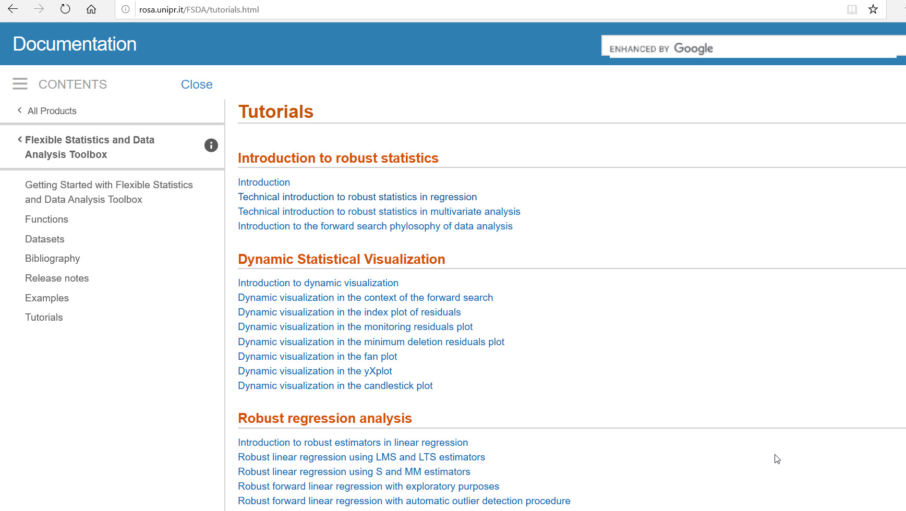](http://rosa.unipr.it/FSDA/tutorials.html)

   

# Installing the toolbox

The installation procedure is fully automatic if FSDA is installed through Get Adds-Ons inside MATLAB.

The most critical part of the installation concerns the FSDA
documentation system, which consists in a series of HTML files that
follow the typical MATLAB style and are completely integrated inside the
MATLAB documentation system.

The html help files can
be found in the Supplemental Software tab** which appears at the
    bottom of the Doc Center home page (see screenshot below)**.**

Similarl to what happens for the MATLAB documentation, the FSDA documentation is shown in a different way depending on the User Preferences.

**Inside Preferences the Documentation Location is "Web"**.

In this case every time the user the user tries to access FSDA documentation it will be redirected to the appropriate page inside http://rosa.unipr.it/FSDA (of course in this case Internet connection is required).

**Inside Preferences the Documentation Location is "Installed Locally"**.

In this case the user has installed the documentation locally.
The first time the user tries to access the FSDA documentation, there is a menu "Copy FSDA HTML help files" which alertes the user that the FSDA help files need to be copied in the local documentation folder. 

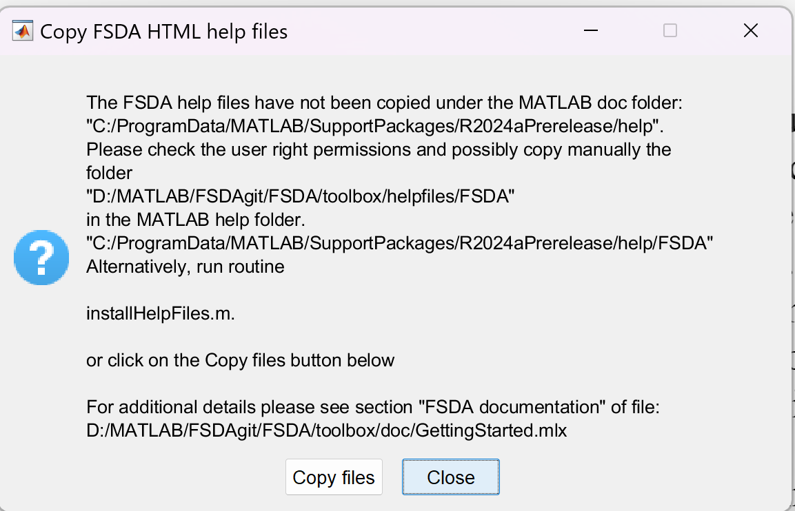

If the user clicks on Yes the files will be copied under the subfolder help of the documentation root folder. If the user clicks on No the user will be redirected to the on line documentation of FSDA.

*Remark*: in order to understand the path of your documentation root folder in your machine it is enough to type docroot in the prompt.

 If everything went well independently of your Documentation Location prefereces you should be able to see the **The FSDA entry page**, as shown below:

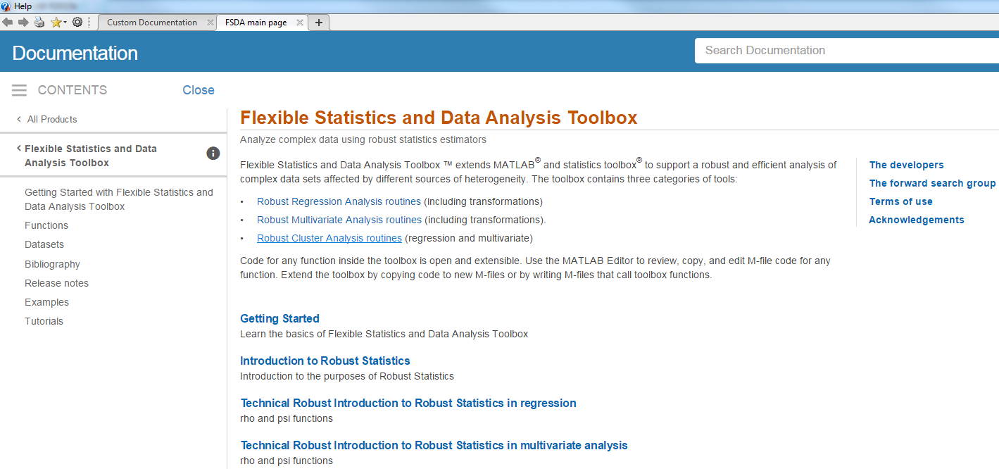

Remark: you can reach our main documentation page also simply typing
docsearchFS in the command prompt

From our main documentation page you can go to the Examples page (see
screenshot below),

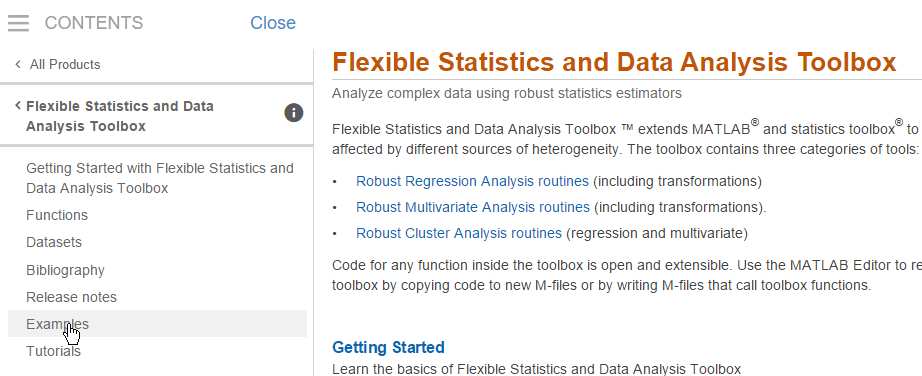

where you can find GUIs, example codes (see screenshot below),

and links to videos containing the analysis of selected examples (see
screenshot below).

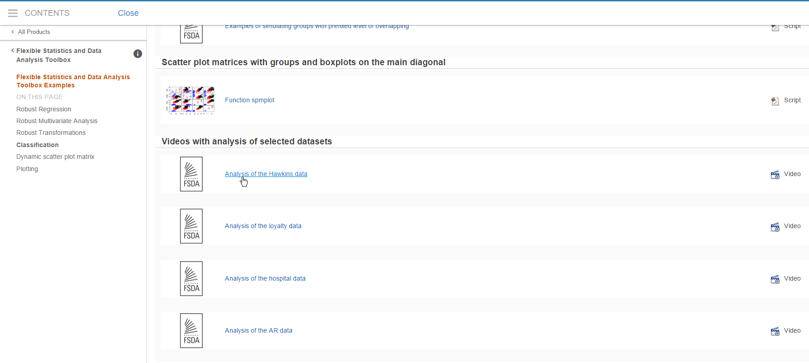

From any point of our documentation system you can go to the "Tutorials"
page (see screenshot below)

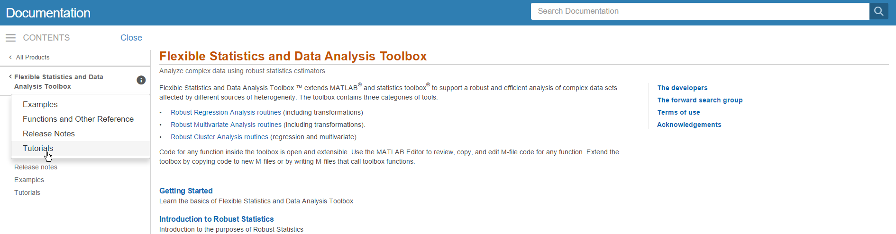

where you can find several tutorials about robust statistics and dynamic
statistical visualization, transformations.... (see screenshot below).

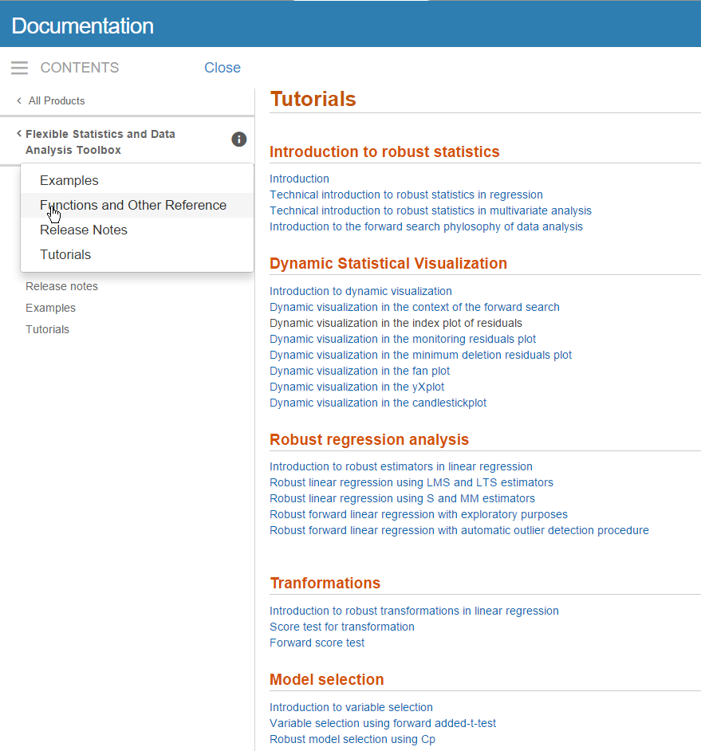

On the other hand, if from the left menu one clicks on "Functions and
Other References" (see screenshot above), it is possible to get the
categorical list of functions present in the toolbox (see screenshot
below).

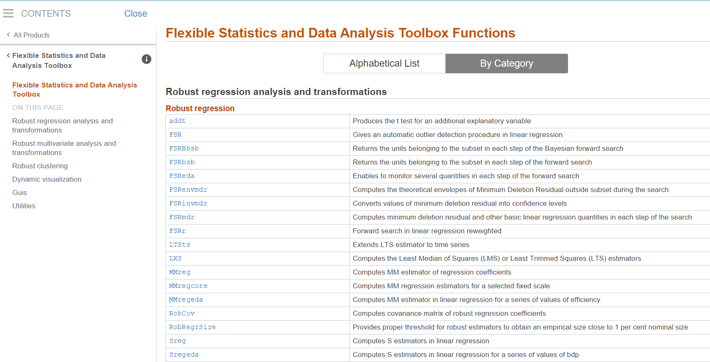

Of course clicking on the button
 it is possible to browse in alphabetical
order the documentation of the 210 functions present inside the FSDA
toolbox (see screenshot below).

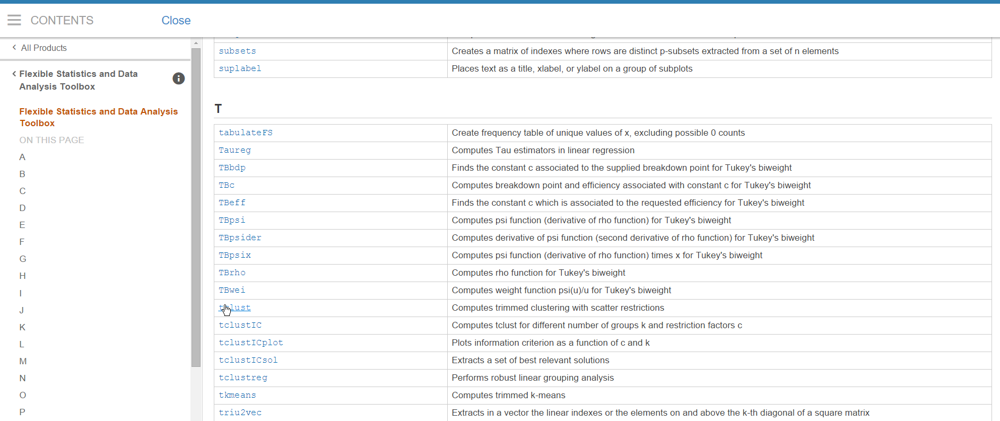

By clicking on one of these links (for example on tclust, see screenshot
above) it is possible to reach the HTML documentation of the function in
a perfect new MATLAB documentation style (see screenshot below).

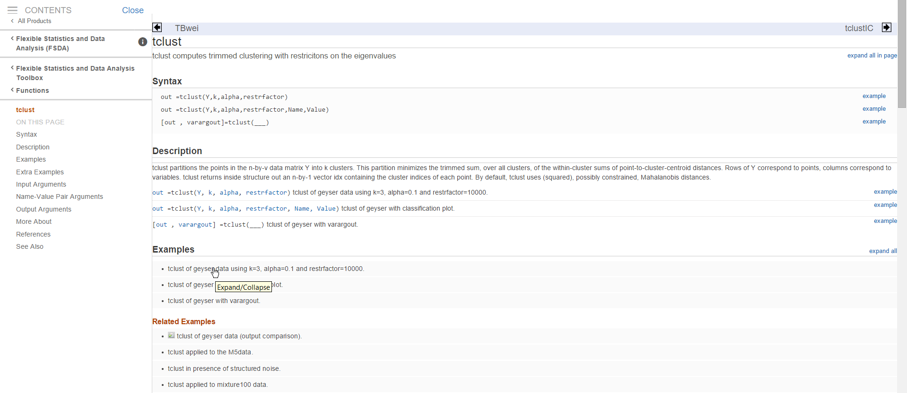
These HTML documentation pages have been created automatically by our
routines publishFS. Every HTML documentation contains a series of
**Examples** and Related Examples.

The icon  at the beginning of the line, indicates
that the associated example has been executed and its output has been
captured inside the HTML file. For example, if you click on the first of
the Related Examples (see screenshot below),

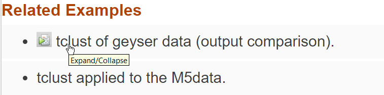

it is possible to see both the code (note that the code is displayed
inside HTML using typical Matlab colouring) and the output which was
generated (see the two screenshots below).

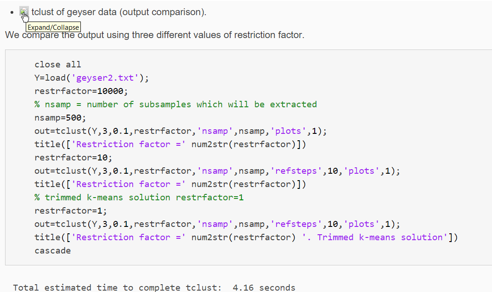

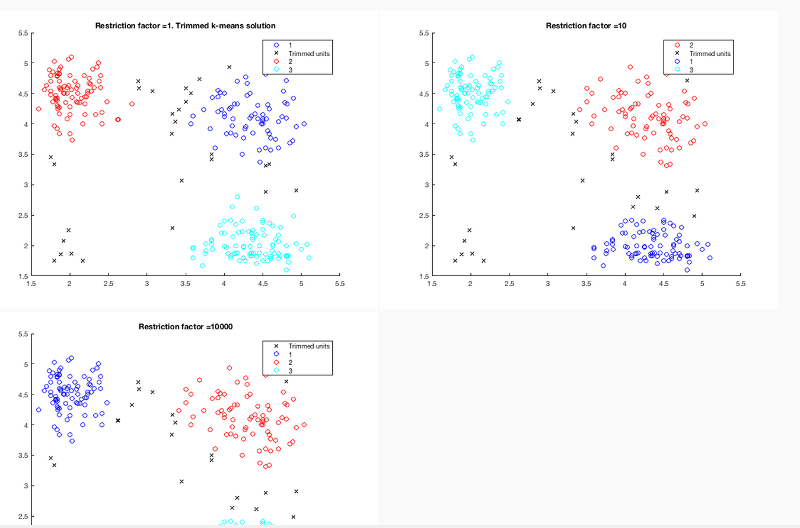

In the More About section of our HTML files (see screenshot below), it
is possible find the theoretical background which accompanies a
particular function.

For example, the screenshot below shows what you get in the case of
function tclust.

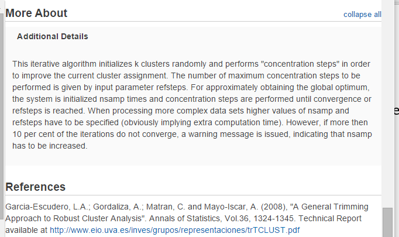

Remark: there is a one to one correspondence between the documentation
contained inside the .m file and the corresponding .html file.

The documentation inside the .m file can be easily accessed from the
command prompt typing help and the name of the function.

For example, the screenshot below shows what you get if you type in the
prompt "help MixSim".

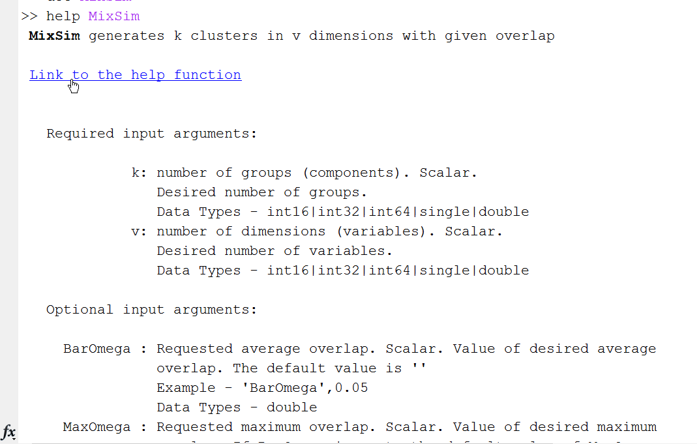

Sometimes inside the .m file (especially in the section "More About") we
have added a number of formulae in latex language (see screenshot
below).

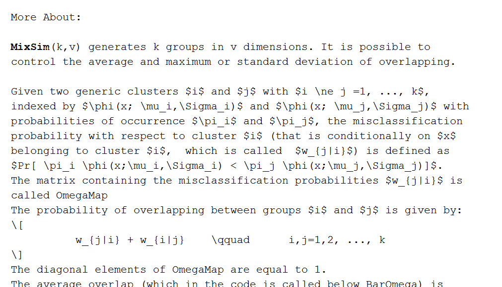

Clearly all these latex formulae will show up correctly (thanks to
MathJax technology) in the corresponding HTML help page. For example, in
the case of MixSim function, in the command window, by clicking on the
link "Link to the help function",

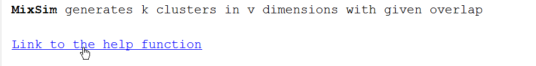

one is redirected to the corresponding HTML documentation page. Here, in
the "More About" section it is possible to see the code in proper
mathematical style.

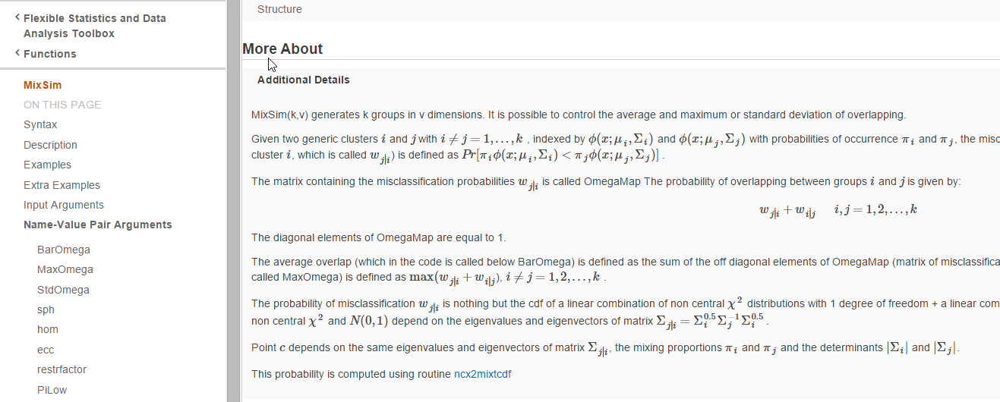

Finally, it is worthwhile to remark that it is possible to go directly
to the HTML documentation page simply typing docsearchFS and the name of
the requested function. For example, in the case of tclust to reach file
tclust.html it is possible to type:

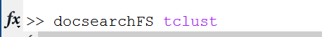

Generally, the output of our functions is a structure, which contains
several fields, documented in detail inside the initial part of the .m
function. For example, in the case of tclust inside tclust.m it is
possible to navigate to section Output(see screenshot below):

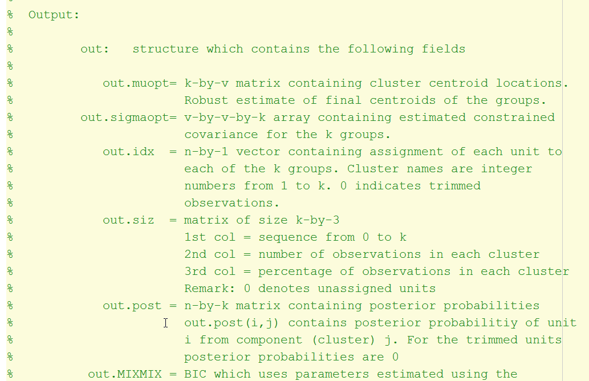

In the corresponding HTML file our parser publishFS.m puts all the
fields of input and output structure inside a HTML table (see screenshot
below):

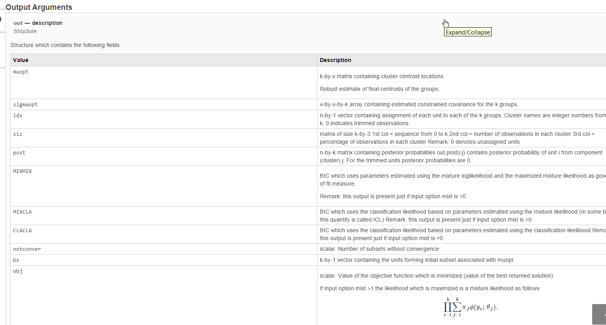

Every subfolder of FSDA contains file contents.m (automatically created
by our routine makecontentsfileFS.m) which contains a series of detailed
information about all the .m files of the folder, which have the
corresponding HTML documentation. For example, the screenshot referred
to the left part of file contents.m inside subfolder "utilities" is
given below.

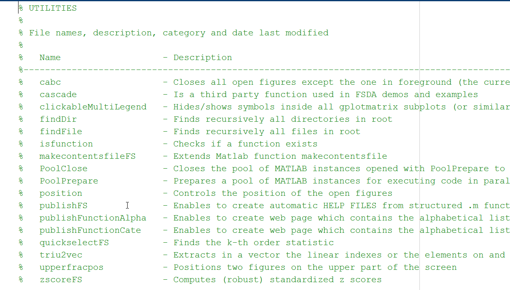

Similarly, inside the main root of FSDA file contents.m lists in
alphabetical order all files present in all subfolders of FSDA, which
have the corresponding HTML page (see screenshot below):

Installation notes (details)

1.  If FSDA has been installed properly (in what follows without loss of
    generality we assume, for example, that FSDA has been installed in
    folder D:\\matlab\\FSDA), after the installation the **"Set Path"
    window of MATLAB should include the following FSDA search paths**
    
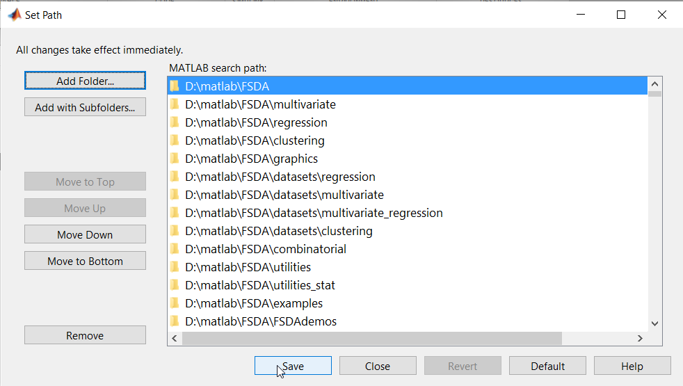

2.  when FSDA is installed three
    APPS (brushRES, brushFAN and brushROB) are automatically installed:

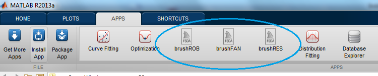

Remark: if the three APPS have not been automatically installed, you can
easily install them manually by double clicking on the files
brushFAN.mlappinstall, brushRES.mlappinstall and brushROB.mlappinstall
contained in the subfolder (FSDAfolder)/toolbox/apps.

> These APPS are graphical user interfaces conceived to demonstrate some
> functionalities of FSDA.

3.  Three example files named
    "examples_regression.m", "examples_multivariate.m", and
    "examples_categorical.m" can be found in (FSDAfolder)/toolbox/examples These files contain a series analysis of several well-known datasets in
    the literature of robust statistics and categorical data analysis
    and have the purpose to let the user familiarize with the toolbox
    

If you think that something not described in these
notes went wrong please do not hesitate to send an e-mail to

<FSDA@unipr.it>

